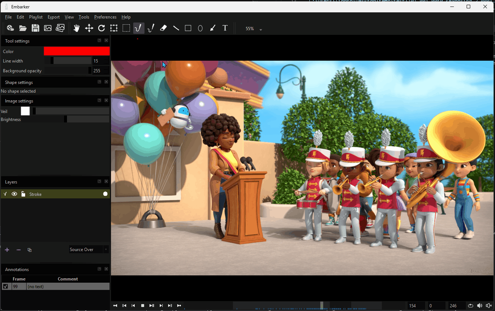
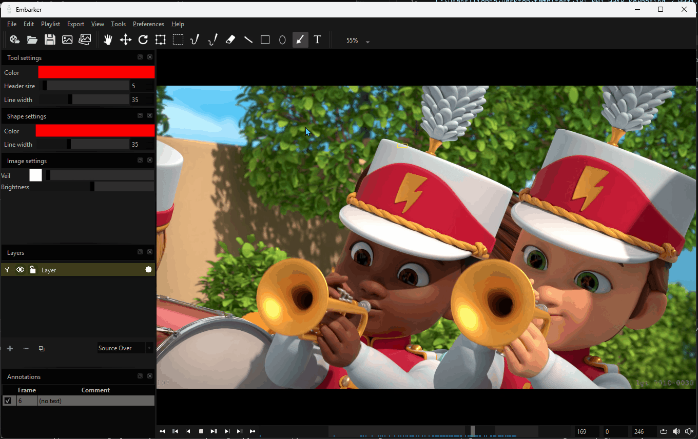
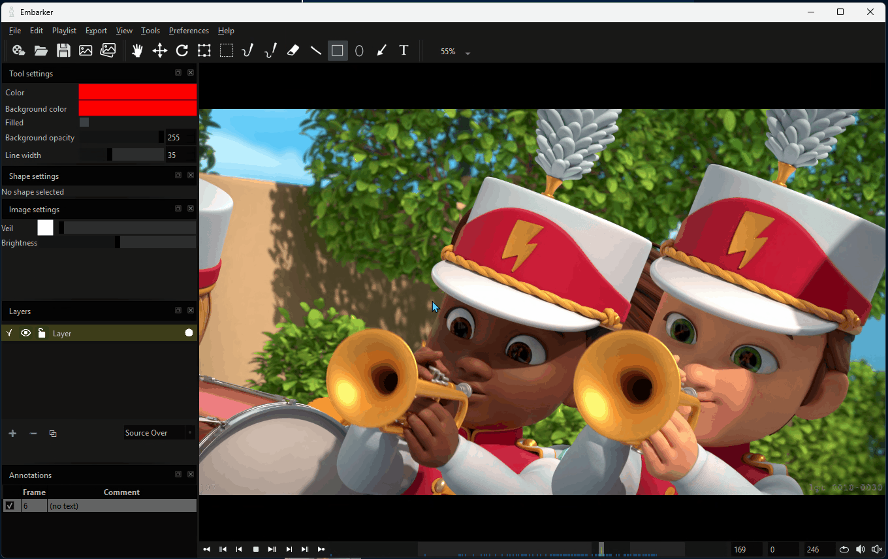
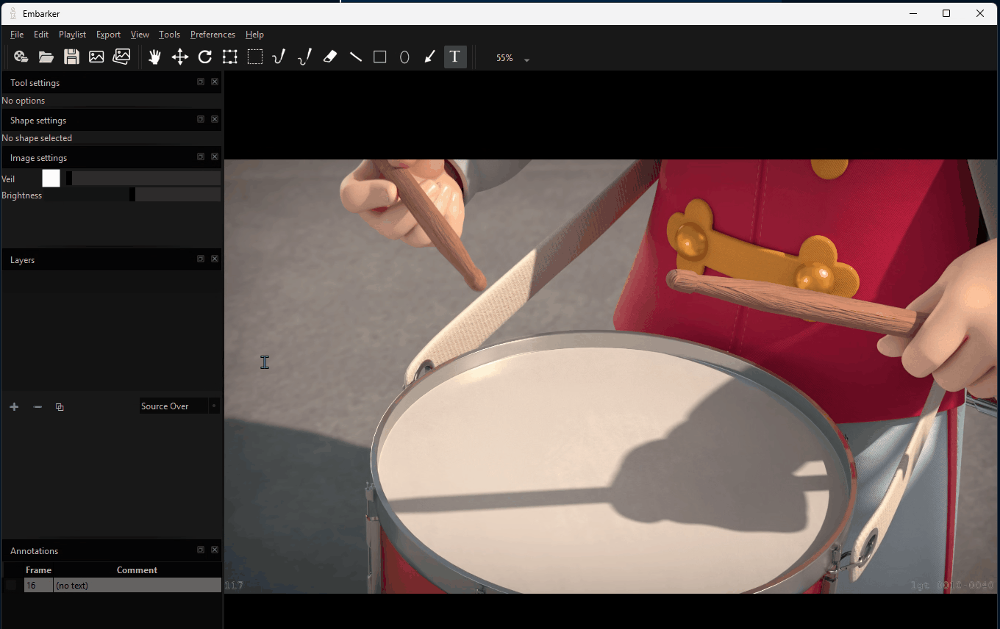

# **DreamWall Embarker**

Authors: Lionel Brouyère, Olivier Evers

Embarker is an open-source video review player designed specifically for reviewing workflows.
It was primarily built to remain simple, facilitate information exchange, and be highly modular, making it easy to integrate into any studio or pipeline environment.

***Core features***

- RAM player with frame-by-frame playback and support for a wide library of video codecs
- Powerful review canvas
- Export of reviewed images
- Very simple yet comprehensive Python API
- Fully scriptable UI using PySide6

***Tools***

- Brush and brush with delay. Pressure supported.
- Lines
- Arrow
- Shapes: circles and rectangles
- Eraser
- ...

  
  
  
  
  

***Pipeline integration***
Create custom plugins and UI to navigate through your tracker and database, and dynamically manage playlist content and annotations.

  

***History***

The tool was developed internally at DreamWall to improve communication across co-productions involving multiple studios working with different trackers and servers. It quickly became clear that automatically sharing feedback from supervisors, leads, or directors working in different systems was not straightforward.

As a result, it became essential to develop tools capable of connecting across various systems, allowing notes to be written and synchronized everywhere without requiring manual exports or forcing teams to learn their partners’ workflows—simply to access critical information for effective communication.

After extensive research for the ideal review tool, we found it difficult to identify a simple player that follows industry standards while meeting pipeline integration requirements, such as a straightforward Python API and a Qt-based user interface.